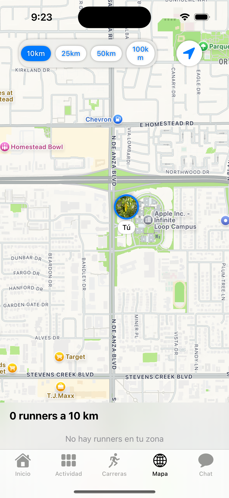
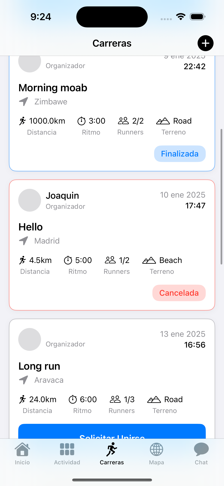
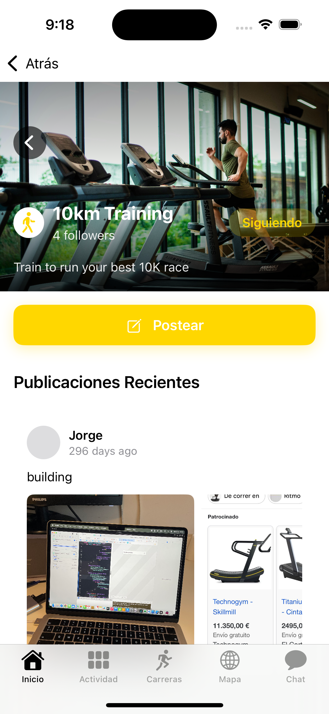

# Runova (Runny)

<p align="center">
  
</p>

<p align="center">
  <strong>A social running app to discover, connect, and run together</strong>
</p>

<p align="center">
  
  
  
  
  
</p>

---

## Overview

**Runova** is a native iOS social application designed for runners who want to find training partners, join group runs, and connect with the running community. Built entirely with SwiftUI and powered by Firebase, it provides real-time location tracking, messaging, and social features.

> **Note:** This is a personal project that was discontinued. The code is shared for portfolio purposes.

---

## Screenshots

<p align="center">
  
  
  
  
</p>

---

## Features

### Core Functionality

- **Discover Nearby Runners** - Find running partners within your area using real-time location
- **Create & Join Runs** - Organize group runs or join existing ones with request/approval system
- **Real-time Chat** - Direct messages and group conversations
- **Interest Communities** - Follow topics you care about and share posts with the community
- **Interactive Map** - See nearby runners on a live map with adjustable radius (10-100km)
- **Connection System** - Send friend requests and build your running network

### User Experience

- **8-Step Onboarding** - Smooth profile setup with validation
- **Multi-language Support** - English and Spanish localization
- **Push Notifications** - Stay updated on friend requests, join approvals, and messages
- **Profile Customization** - Goals, interests, pace, and profile photos

---

## Tech Stack

| Category | Technology |
|----------|------------|
| **UI Framework** | SwiftUI 5.0 |
| **Architecture** | MVVM |
| **Backend** | Firebase (Auth, Firestore, Storage) |
| **Maps** | MapKit |
| **Location** | CoreLocation |
| **Media** | PhotosUI, AVFoundation |
| **Reactive** | Combine |

---

## Project Structure

```
Runny/
├── Models/                 # Data models (User, Run, Message, etc.)
│   └── InterestsModels/    # Community-related models
├── Views/                  # SwiftUI views organized by feature
│   ├── Authentication/     # Login, Signup, Auth management
│   ├── Onboarding/         # 8-step onboarding flow
│   ├── HomeView/           # Discovery, Interests, Runners
│   ├── RunsView/           # Run management & details
│   ├── ChatView/           # Messaging system
│   ├── MapView/            # Interactive map
│   ├── ProfileView/        # User profile & settings
│   └── FeedView/           # Social feed
├── Managers/               # Business logic (Location, Connections, etc.)
├── Services/               # API services (Post, Comment, User)
├── Extensions/             # Swift extensions
└── Resources/              # Localization files
```

---

## Architecture

The app follows the **MVVM (Model-View-ViewModel)** pattern:

- **Models** - Pure data structures with Firestore encoding/decoding
- **ViewModels** - Handle business logic, API calls, and state management
- **Views** - SwiftUI declarative UI components
- **Managers** - Singleton services for cross-cutting concerns (Location, Storage, etc.)
- **Services** - Data layer abstractions for Firestore operations

### Key Patterns Used

- `@StateObject` / `@Published` for reactive state
- `ObservableObject` protocol for ViewModels
- Firestore snapshot listeners for real-time updates
- Async/await for modern concurrency
- DispatchGroup for coordinated async operations

---

## Getting Started

### Prerequisites

- Xcode 15.0+
- iOS 17.0+
- Firebase account

### Installation

1. **Clone the repository**
   ```bash
   git clone https://github.com/yourusername/runova.git
   cd runova
   ```

2. **Configure Firebase**
   - Create a new Firebase project at [Firebase Console](https://console.firebase.google.com)
   - Enable Authentication (Email/Password)
   - Create a Firestore database
   - Enable Storage
   - Download `GoogleService-Info.plist`
   - Place it in `Runny/Info /GoogleService-Info.plist`

3. **Install dependencies**
   ```bash
   pod install
   ```

4. **Open the workspace**
   ```bash
   open Runny.xcworkspace
   ```

5. **Build and run**
   - Select your target device/simulator
   - Press `Cmd + R`

### Firebase Configuration

Copy the example configuration and fill in your credentials:

```bash
cp "Runny/Info /GoogleService-Info.plist.example" "Runny/Info /GoogleService-Info.plist"
```

---

## Firestore Security Rules

The project includes comprehensive security rules in `firestore.rules`:

- Authentication required for all operations
- Role-based access (creator, participant, admin)
- Protected subcollections (joinRequests, comments, likes)
- Field-level validation

---

## Localization

The app supports:
- English (en)
- Spanish (es)

Localization files are in `Resources/[lang].lproj/Localizable.strings`

---

## What I Learned

Building Runova taught me:

- **SwiftUI Mastery** - Complex navigation, animations, and state management
- **Firebase Integration** - Real-time sync, security rules, and efficient queries
- **Location Services** - Background updates, geofencing, and MapKit integration
- **App Architecture** - Scaling MVVM for a medium-sized project
- **UX Design** - Onboarding flows, empty states, and loading patterns

---

## Future Improvements (If Continued)

- [ ] Apple Sign In / Google Sign In
- [ ] Running route tracking with GPS
- [ ] Activity statistics and history
- [ ] Strava/Apple Health integration
- [ ] Dark mode support
- [ ] Push notifications via APNs

---

## License

This project is open source and available under the [MIT License](LICENSE).

---

## Author

**Eduardo Tenés**

- GitHub: [@tenesedu](https://github.com/tenesedu)
- LinkedIn: [Eduardo Tenes](https://www.linkedin.com/in/eduardoten%C3%A9st/)

## Contributors

**Joaquin Tenés**

---

<p align="center">
  <sub>Built with SwiftUI and Firebase</sub>
</p>
